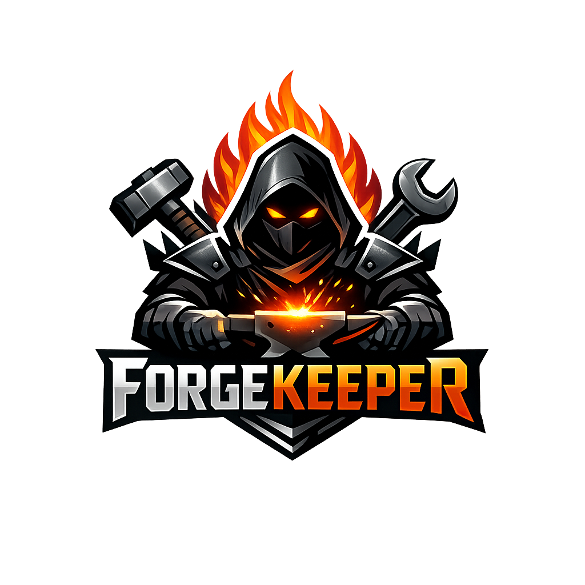

# ForgeKeeper

  

ForgeKeeper is meant to be the most capable developer container available. This spec captures what needs to be installed in the image and the workflows the container should enable once a developer attaches to it. The ForgeKeeper identity above should appear anywhere this project surfaces—from README to terminal banners and hosted IDE welcome screens.

## Vision & Pillars
- **Polyglot first**: Ready for web, backend, infrastructure, and ML projects without extra installs.
- **Fast feedback**: Opinionated tooling, formatters, and task runners that make tests, lint, and builds one command away.
- **Hermetic yet extensible**: Deterministic installs via pinned versions, but easy overrides through a runtime manager (mise/asdf).
- **Secure by default**: Secrets handling, scanning, and least-privileged defaults baked in.
- **Delightful ergonomics**: Pre-tuned shell, editors, prompt, and helpers for day-to-day work.

## Base Image & Layering
1. **Base**: `mcr.microsoft.com/devcontainers/base:ubuntu-24.04` (glibc, systemd, GPU-capable).
2. **Locale/timezone**: UTF-8 locales, `tzdata`, consistent timezone (UTC) with ability to override via env.
3. **Non-root user**: `dev` user with passwordless sudo, docker group membership, zsh as default shell.
4. **Dotfiles bootstrap**: Optional Git-based dotfiles sync (run on first attach) with caching to `/workspaces/.cache/dotfiles`.

## Core System Packages
- Build essentials: `build-essential`, `cmake`, `ninja-build`, `pkg-config`, `gdb`, `lldb`, `valgrind`.
- Shell/UI: `zsh`, `fish`, `tmux`, `zellij`, `starship`, `fzf`, `ripgrep`, `fd`, `bat`, `delta`, `direnv`, `just`, `gh`, `gpg`.
- Networking & diagnostics: `netcat-openbsd`, `iperf3`, `httpie`, `curl`, `wget`, `jq`, `yq`, `dnsutils`, `traceroute`.
- Troubleshooting/monitoring: `htop`, `btop`, `glances`, `iotop`, `iftop`, `nvtop`, `strace`, `lsof`, `sysstat`, `procs`.
- Fonts/themes: Nerd Fonts (JetBrains Mono, Fira Code) copied to `/usr/local/share/fonts` for GUI editor attachments.

## Runtime & Package Management Strategy
- **mise** (preferred) or **asdf** for installing language/tool versions per-project via `.tool-versions` / `mise.toml`.
- Global caches persisted to `/workspaces/.cache` to survive rebuilds.

### JavaScript / TypeScript / Front-end
- Node.js 20 LTS + 22 current, installed via mise; `corepack enable` for Yarn/PNPM.
- Extras: `bun`, `deno`, `eslint`, `prettier`, `tsc`, `vitest`, `playwright` browsers, `turborepo` CLI.

### Python & Data
- CPython 3.12 + 3.11 (mise), `uv` for dependency resolution, `pipx`, `poetry`, `rye`, `tox`, `pytest`, `ruff`, `black`, `mypy`.
- Data tooling: `jupyterlab`, `ipykernel`, `pandas`, `numpy`, `scipy`, `polars`, `matplotlib`, `scikit-learn`.
- ML accelerators optional: CUDA toolkits toggled via build arg.

### Go
- Go 1.22, `delve`, `gofumpt`, `golangci-lint`, `air` (live reload), `mockgen`.

### Rust
- `rustup` with stable + nightly toolchains, `clippy`, `rustfmt`, `cargo-nextest`, `cargo-watch`, `wasm32` target.

### JVM & Polyglot
- Temurin JDK 21 + 17, `maven`, `gradle`, `jabba` support, `coursier`, Kotlin compiler, Scala (via sbt) for polyglot builds.

### .NET & C#
- .NET SDK 8.0 + 7.0, `omnisharp`, `dotnet-ef`, `dotnet-script`.

### Other Languages
- Ruby 3.3 (rbenv via mise), `bundler`, `jekyll`.
- PHP 8.3 + Composer.
- Elixir/Erlang (via mise), `hex`, `rebar3`.

## Container, Cloud, and Infra Tooling
- Docker CLI + Docker Compose v2, `nerdctl`, `buildx`, `img`, `dive` for image inspection.
- Kubernetes: `kubectl`, `helm`, `kustomize`, `kind`, `minikube`, `skaffold`, `k9s`.
- HashiStack: `terraform`, `packer`, `vault`, `consul`, `nomad`, `boundary` CLIs.
- Cloud SDKs: `awscli`, `aws-vault`, `sam`, `gcloud`, `kubelogin`, `az`, `doctl`, `flyctl`, `heroku`, `supabase`, `vercel`, `netlify`.
- IaC/QoL: `ansible`, `pulumi`, `cue`, `opa`, `conftest`.

## Observability & QA Tooling
- Testing: `act` (GitHub Actions local), `tilt`, `k6`, `locust`, `newman`, `mockoon-cli`.
- Debug proxies: `mitmproxy`, `ngrok`, `cloudflared tunnel`, `httptoolkit-server`.
- Tracing/logging: `otel-cli`, `tempo-cli`, `loki-canary`, `stern`, `kubetail`.
- Static analysis/security: `semgrep`, `trivy`, `grype`, `syft`, `gitleaks`, `bandit`, `cargo-audit`, `npm audit` wrappers, `dependabot` config generator.

## Local Services to Run Inside the Container
Provisioned through docker-compose within the devcontainer so they can be toggled per project:
- Datastores: PostgreSQL 16, MySQL 8, Redis 7, KeyDB, MongoDB 7, Elasticsearch/OpenSearch, Meilisearch, MinIO, RabbitMQ, Kafka/Redpanda, LocalStack, Azurite, MailHog, Temporal, NATS.
- Feature flag/testing: Flipt, Testcontainers CLI for ephemeral dependency bootstrapping.
- Reverse proxies: Caddy, Traefik for TLS termination during dev.

## Developer Ergonomics

- Shell customizations: zsh default with Oh My Zsh, starship prompt, autosuggestions, syntax highlighting, `direnv` hooks, alias pack for kubectl/terraform.
- Editor helpers: preinstalled VS Code extensions (Dev Containers, ESLint, Prettier, Python, Rust Analyzer, Go, Docker, YAML, Terraform, GitHub Copilot), Neovim nightly with LazyVim distribution, Helix for lightweight editing.
- Tiling multiplexer: tmux with `tmuxinator forgekeeper.yml`, Zellij layout preconfigured with panes (editor/tests/logs).
- Git experience: `lazygit`, `forgit`, commit template, conventional commits CLI, `pre-commit` with shared hook set.

## Web IDE & Hosted Tooling

- ForgeKeeper Portal (port `7000`): animated splash (logo fade-in + "Welcome to the Forge" typing effect) that routes to a dashboard listing every hosted UI plus quick actions to power down/reset the container via `/forgekeeper/control`. Bookmarkable homepage with status cards and the logo everywhere.
- **Portal Controls**: `/forgekeeper/control` is served from the portal itself via `portal/server.py`. It shells out to `/usr/local/bin/forgekeeper-control.sh` where `shutdown` terminates PID 1 (stopping the container) and `reset` wipes `/workspaces/*` before restarting supervised services. Extend the script for enterprise-grade workflows if you need custom automation.
- VS Code Server: bundle `code-server`/`openvscode-server` configured to start under supervisor, published on `8080` with optional TLS/oidc. On first launch a bootstrap script prompts for email/username/workspace and renders a ForgeKeeper ASCII banner plus `cowsay` greeting in every shell session.
- Every hosted surface (code-server welcome, JupyterLab, ttyd landing page) should load the ForgeKeeper logo from `logo/Forge.png` so the brand is front and center even before attaching a shell.
- Browser-based terminals: `ttyd` + `wetty` so users with only a browser can drop into zsh/tmux. Session banners reuse the collected identity metadata.
- Data/ML surfaces: expose `JupyterLab`, `TensorBoard`, `mlflow ui` via dedicated ports, proxied through Traefik for auth and HTTPS.
- Ops dashboards: ship `Portainer` (Docker), `Lazydocker`, `pgAdmin`, `Adminer`, `RedisInsight`, and `Meilisearch` console to manage local services without extra installs.
- Documentation/knowledge: host `mkdocs serve` or `Docsify` container for project docs previews, plus `miniserve` for quick artifact downloads.

## Inside-Container Workflows
### Automation Scripts
Use a `justfile` (or `taskfile`) with canonical recipes:
- `just bootstrap`: Sync dotfiles, install mise tools, fetch git hooks, install VS Code extensions.
- `just update`: Refresh base packages, run security scanners, update lockfiles, regenerate SBOM via `syft`.
- `just qa`: Run formatters, linters, unit tests, coverage, type checks for every supported language.
- `just db.up` / `just db.down`: Stand up or tear down docker-compose defined services.
- `just ship`: Build container image, run integration tests, produce release artifacts.

### Branding & Session Personalization

- Build script prompts for `FORGEKEEPER_USER_EMAIL`, `FORGEKEEPER_HANDLE`, and `FORGEKEEPER_WORKSPACE` (interactive when run locally, env-driven in CI). Values flow into Docker labels, `devcontainer.json` env, and `/etc/forgekeeper/motd.d/banner`.
- First shell attach runs `gum format` + `figlet` + `lolcat` to render the ForgeKeeper badge, followed by `cowsay` summarizing who/what the session is for. Banner is rehydrated inside tmux panes and web terminals.
- Metadata is logged (with opt-out) to `/var/log/forgekeeper/sessions.log` for auditing build usage and powering weekly summary emails.

### Lifecycle Hooks (devcontainer.json)
- `onCreateCommand`: `just bootstrap` + `pre-commit install` + `mise install` + `direnv allow`.
- `postCreateCommand`: Seed local databases with fixtures, run migrations, start background watchers (`air`, `cargo watch`, `npm run dev`).
- `postStartCommand`: Launch `tmuxinator forgekeeper`, attach to tmux automatically, present status dashboard.
- `postAttachCommand`: Run `mise doctor`, print versions, tail logs for running services.

### Daily Flow for Developers
1. **Attach** ➜ automatically drop into tmux session with panes for editor, `just monitor`, and `k9s` (if Kubernetes services are active).
2. **Sync runtimes** ➜ `mise install` ensures Node/Python/Go/etc match `.tool-versions`.
3. **Start dependencies** ➜ `just db.up` or `docker compose up` for stack-specific needs.
4. **Run watchers** ➜ `npm run dev`, `air`, `cargo watch -x check`, etc., configured via Procfile.dev.
5. **QA loop** ➜ `just qa` or language-specific (e.g., `uv run pytest`, `pnpm test`, `go test ./...`).
6. **Preflight before push** ➜ `just ship` ensures SBOM, vulnerability scan (`trivy fs .`), git hooks, changelog generation.

## Security & Compliance

- Secrets: Support for `1password-cli`, `aws-vault`, `doppler`, `sops`, `age`; mount `/workspaces/.secrets` with git-ignored templates.
- Mandatory `pre-commit` hooks: `detect-secrets`, `checkov`, `eslint --max-warnings=0`, `ruff`, `go fmt`, `terraform fmt`, `hadolint`.
- Image scanning: nightly `trivy image forgekeeper` plus SBOM generation via `syft` committed to `sbom/`.
- Supply chain: `cosign` for signing, `slsa-verifier` for verifying upstream binaries.

## Performance & Caching
- Enable docker build cache mounts for package managers (npm cache, pip cache, go build cache, cargo registry).
- Use `vscode-remote.tryWorkspaceMount` to mount host `~/.ssh` read-only, host docker socket optional.
- Optional remote cache providers: `bazelisk` with RBE stub, `buildkitd` with `BUILDKIT_PROGRESS=plain` for CI parity.

## Telemetry & Reporting
- `just status` command outputs versions, running services, disk usage, network forwarding info.
- Healthcheck script ensures runtime managers, watchers, and services are up; surfaces results in VS Code "Ports" / "Dev Containers" panels.

## Local Orchestration & Testing
- `docker-compose.yml` ships with all required port bindings and build args; run `docker compose up --build forgekeeper` to boot the full stack locally.
- `devcontainer.json` allows attaching with VS Code Remote Containers; set `FORGEKEEPER_*` env vars locally before rebuild to personalize banners.
- Supervisor launches code-server, openvscode, Jupyter, ttyd, MLflow, and the ForgeKeeper Portal automatically from the entrypoint. Logs land in `/var/log/forgekeeper/`.
- Portal power/reset buttons call the control endpoint; use them to validate shutdown/reset flows before wiring CI/CD automation.

## Next Steps
- Connect `/forgekeeper/control` to your orchestration (or extend `forgekeeper-control.sh`) for production-grade shutdown/reset approvals.
- Set up nightly `docker build && docker push` (e.g., GitHub Actions) and add the resulting status badge to the README header.
- Document onboarding plus architecture diagrams for the hosted service mesh.
